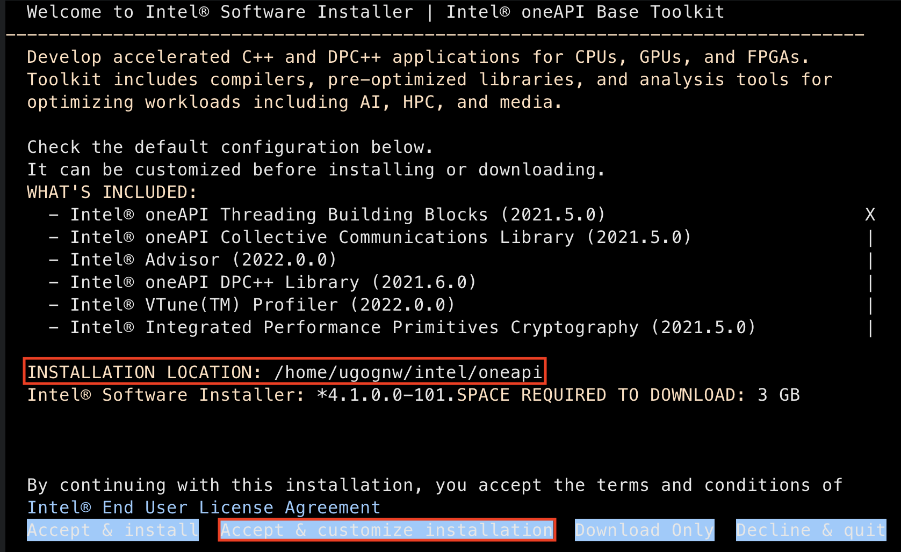
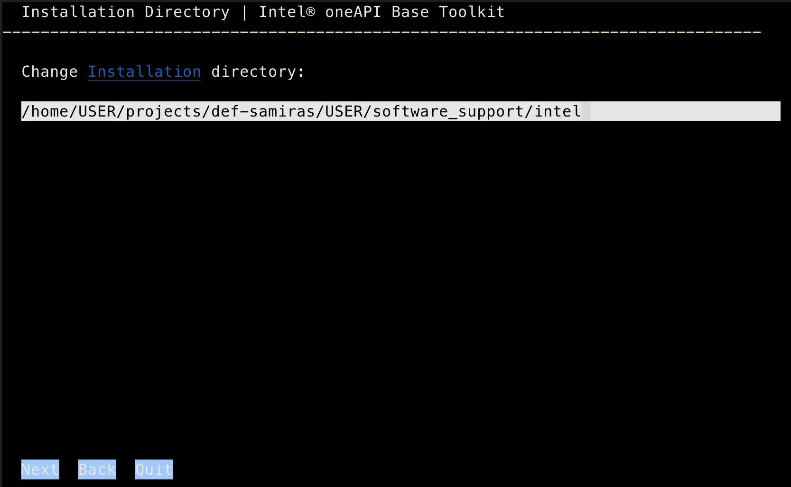

# :sparkles: Make your own Quantum ESPRESSO compilation :sparkles:

Last Updated: October 18, 2024

## Overview

This guide will walk through compiling Quantum Espresso with the following
options

- compiled with Intel OneAPI libraries
- signal trapping: This enables QE to recognize common signals sent by job schedulers
  (e.g., SIGTERM) and exit gracefully
- exit statuses
- [libxc][libxc] support: This expands the library of functionals that can be used

## Tips

You may need to replace `def-samiras` with a valid project directory. To see
which project directories are available, run:

```shell
ls ~/projects
```

## Step-by-Step

:female-technologist:  Here's a (not really) quick step-by-step to compile
Quantum Espresso (QE) 7.2  :female-technologist:

1. **Download the Intel libraries** from [here][oneapi-libs].

2. **Copy the folder/archive of files** (4) to where you
   will install QE. This may be in your home directory (e.g., `/home/$USER`) or
   a subdirectory of your project folder (e.g.,
   `/home/$USER/projects/def-samiras/$USER/software_support`).

   ```shell
   scp -r oneapi_archive $USER@Cedar.computecanada.ca:/home/$USER/
   ```

   :note: These libraries are from the [OneAPI suite][oneapi-suite], however,
   only the current year's libraries are available for download for free. The
   2024 libraries were tested and they did not work for QE compilation on
   Cedar. The 2022 have been confirmed to worked. Both the 2022 and 2023
   libraries are included in the shared folder from step 1.

3. **Install the Base Toolkit.** (This could take up to 30 minutes.)
   Navigate to where you copied the folder on Cedar

   ```shell
   $SHELL l_BaseKit_p_2022.1.1.119.sh
   ```

   This will install the Base Toolkit under the directory
   `/home/USER/intel/oneapi` (where `USER` is your DRA username).

   Optionally, you can change the installation location by opting to
   customize the installation (select "Accept & customize installation" prior
   to starting the installation process).

   

   You may want to do this if you would like the libraries to be accessible
   for others, in which case, change the default installation directory to a
   subdirectory of the project folder. For example,

   

   :warning: You may receive warnings about the operating system being
   "Unknown" or missing packages required for the Intel® VTune(TM) Profiler,
   but you can ignore these.

   :note: You can skip the Eclipse* IDE Integration Configuration step.

4. **Install the HPC Toolkit.** (This shouldn't take more than a few minutes.)

   ```shell
   $SHELL l_HPCKit_p_2022.1.1.97.sh
   ```

   Again, you may want to specify a custom installation location. In that case,
   it is reasonable to create a `oneapi` directory as a subdirectory of the
   custom location specified for the Base Toolkit and use this as the
   installation location.

   At this point, the directory that was chosen as the installation location
   should be populated with the Intel libraries, and there should be a file
   called `setvars.sh`, which when sourced (e.g., `source setvars.sh`), should
   give you a list of modules loaded in the environment. Check this step prior
   to QE compilation.

5. **Download Quantum Espresso 7.3.1**. You can get QE [here][qe-7.3.1].
   Alternatively, you can just go to their homepage, register your email,
   and go to Downloads > to find version 7.2.

6. Copy the downloaded `QE.tar` file to Cedar and extract it.

7. **Forcibly purge your loaded modules.**

   ```shell
   module --force purge
   ```

   :warning: This is important: the main problem with Cedar seems to be some
   library/ies dependency, so make sure you run module --force purge before
   moving on.

8. **Setup the Intel environment.**

   ```shell
   source setvars.sh
   ```

9. **Locate the root directory for libxc.**
   On Cedar, this directory is found at
   `/cvmfs/soft.computecanada.ca/easybuild/software/2023/x86-64-v3/Compiler/gcc12/libxc/6.2.2`

   :note: Note that the latest version of libxc (7.0.0) is not installed on
   Cedar. However, installing libxc is quite straightforward. Instructions can
   be found [here][libxc-installation].

10. Ensure that the local language is set to the standard, i.e. ”C”.

    ```shell
    export LC_ALL=C
    ```

11. **Configure the QE compilation.**

    For clarity, define variables for the
    location of the Intel Base Toolkit, HDF5, and libxc directories. For example,

    ```shell
    intel_dir=/home/$USER/projects/def-samiras/$USER/software_support/intel
    ```

    Next, specify a path (outside of the current directory) where you would
    like to install the QE executables.

    ```shell
    espresso_dir=/home/$USER/projects/def-samiras/$USER/software/espresso-7.3.1
    ```

    :note: Note that these directories must be **absolute** paths (i.e., starting
    with `/`).

    Now, change your current working directory to the `qe-7.3.1` directory and
    run the `configure` script.

    ```shell
    cd qe-7.3.1
     ./configure LIBDIRS="/cvmfs/soft.computecanada.ca/easybuild/software/2023/x86-64-v3/Core/imkl/2023.2.0/mkl /cvmfs/restricted.computecanada.ca/easybuild/software/2023/x86-64-v3/Core/intel/2023.2.1/mpi /cvmfs/restricted.computecanada.ca/easybuild/software/2023/x86-64-v3/Core/intel/2023.2.1/compiler" --enable-parallel --with-scalapack=intel FC=ifort F90=ifort mpif90=mpiifort CC=icc mpicc=mpiicc --enable-signals --enable-exit-status --prefix=/home/ugognw/projects/def-samiras/ugognw/software/espresso-7.3.1  --with-hdf5=yes --with-libxc --with-libxc-prefix=/home/ugognw/projects/def-samiras/ugognw/software/libxc-7.0.0
     ```

13. **Modify the `make.inc` file to configure libxc.**

    This includes:

    - adding `-D__LIBXC` to `DFLAGS`
    - adding `-I/path/to/libxc/include/` to `IFLAGS`
    - setting `LD_LIBS=-L/path/to/libxc/lib/ -lxcf03 -lxc`
  
    Note that `/path/to/libxc` should be the path determined in step 12.

14. Begin the installation.

    ```shell
    make all
    ```

    :star2: The [QE manual][qe-manual] is really good and useful and easy to
    follow, in case you want to test different things on your own.

    :red_circle: You can also compile their default version, which is mostly
    oolproof and easy, and test it. It usually finds its own way and works
    well. Beware that there is a problem with library dependencies in the
    cluster, so if you compile the default version, it will have the same
    libraries as the cluster version and likely have the same issues!

    :note: **Tip**: If you are performing the compilation as an interactive
    job with multiple cores, you can speed up this step by running `make` in
    parallel. To do this, specify the number of cores available as an option
    to make with the `-j` option. For example, if your interactive job has 8
    cores, run:

    ```shell
    make -j8 all
    ```

    :note: This will take a while, (between minutes and hour-ish), so be sure
    to have some time at this step. Keep an eye on what will come up at the
    screen, because this will inform whether or not QE found the libraries
    you told it to, or if it skipped any of them. It will also let you know
    if the parallel compilation was successfully identified (QE has different
    compilations for serial and parallel execution). Make sure it found all
    dependencies you need before moving on.

configure Environ and other modules

## Running a sample calculation

The following commands should be added to your SLURM submission script to run
calculations with QE.

```shell
module --force purge
source /home/YOURUSERNAME/intel/oneapi/setvars.sh
export PATH=$PATH:/home/YOURUSERNAME/qe-7.2/bin/
export PATH=$PATH:/home/YOURUSERNAME/intel/oneapi/mpi/2021.5.0/bin
/home/YOURUSERNAME/intel/oneapi/mpi/2021.5.0/bin/mpirun -np XXX /home/YOURUSERNAME/qe-7.2/bin/pw.x < espresso.in > espresso.out```

=====================================================
Finally, benchmark and test its performance using their provided examples or your job. What to look for:
The performance should be equivalent to their examples for simple structures with similar parameters. For unit cells, it is useless to scale up too many cores, so test it with few at first (1 core vs 2 vs 4, for example). Check the last lines of the out file the total CPU time and resources. If the performance is worse with more cores, the compilation is not good.
Check the performance of a decent sized job with your compilation against the one available in Cedar, the time should be around half but it will also depend on your own system (it was half for mine with a ~100 atoms supercell). If it is similar to Cedar, or worse, again, the compilation it not good.

[oneapi-libs]: https://1sfu-my.sharepoint.com/:u:/g/personal/lebarbos_sfu_ca/EYL5CdD_j99OmZirKP2MV4cBTJ-FPv0yE_fB28Jmnr_RVQ?e=xnV2Hd
[oneapi-suite]: https://www.intel.com/content/www/us/en/developer/tools/oneapi/overview.html#gs.dhpux3
[qe-7.3.1]: https://www.quantum-espresso.org/rdm-download/488/v7-3-1/b44218b83782ba64fb5b47781e0fbcfb/qe-7.3.1-ReleasePack.tar.gz
[qe-manual]: https://www.quantum-espresso.org/Doc/user_guide_PDF/user_guide.pdf
[libxc]: https://libxc.gitlab.io/
[libxc-installation]: https://libxc.gitlab.io/installation/
